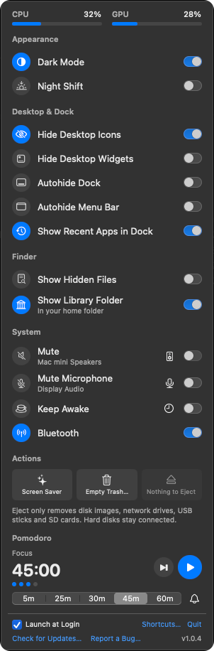

# Switchboard

A Mac menu bar panel of quick toggles: Dark Mode, Night Shift, hiding desktop icons, the
Dock or the menu bar, hidden files, mute, Bluetooth, keeping the Mac awake and more,
each showing its real current state. Plus a Pomodoro timer, CPU and GPU meters, and a
global keyboard shortcut for anything. Native Swift, very light on your Mac (it doesn't
poll), free and open source.

<p align="center"></p>

## Download

**[Download the latest Switchboard](https://github.com/jhokanson00/Switchboard/releases/latest)**:
open the `.dmg` and drag Switchboard to Applications, then open it. It lives in the menu
bar as a light switch; there's no Dock icon. Switchboard checks for updates once a day,
or choose **Check for Updates…** at the bottom of the panel.

- macOS 15 or later. Apple silicon and Intel.
- Signed with Developer ID and notarized by Apple; updates are signed too. See
  [Privacy and security](#privacy-and-security).

## What's in it

**Settings**, each a switch that shows what macOS is set to right now:

- **Appearance:** Dark Mode, Night Shift.
- **Desktop & Dock:** Hide Desktop Icons, Hide Desktop Widgets, Autohide Dock, Autohide
  Menu Bar, Show Recent Apps in Dock.
- **Finder:** Show Hidden Files, Show Library Folder.
- **System:** Mute, Mute Microphone, Keep Awake, Bluetooth.

**Mute** and **Mute Microphone** work on whatever output and microphone your Mac is
using right now, and show its name. When there's more than one, the speaker and mic
buttons on those rows switch to another output or microphone, like the Sound menu in
Control Center. Some devices, like
many USB audio interfaces, have no mute switch; the row says so.

**Keep Awake** can run until you turn it off, for 1 to 8 hours, or while a particular app
is open (say, until Final Cut Pro finishes and quits). Use the clock button on its row.

**Actions:** Start Screen Saver; Empty Trash (always asks first, with the item count);
Eject, which ejects disk images, network drives, USB sticks and SD cards but leaves hard
disks connected. If something is holding a drive, Eject names the app.

**Pomodoro:** focus for 5, 25, 30, 45 or 60 minutes, then a 5-minute break, with a
15-minute break after every fourth session. While it runs, the minutes left show in the
menu bar. When each phase ends, a sound plays three times and a pop-up stays in the middle
of the screen until you answer it; Focus and Do Not Disturb don't hold either back. The
bell next to the focus lengths picks the sound, turns the pop-up off (a notification is
sent instead), or plays a test. While the timer runs, the Mac doesn't go to sleep on its own,
so the end isn't missed; the display still can.

**At a glance:** CPU and GPU load at the top of the panel.

**Launch at Login** is a checkbox at the bottom.

### Keyboard shortcuts

Any setting or action can have a global shortcut that works from any app: choose
**Shortcuts…** at the bottom of the panel. **Use Suggested** assigns ⌃⌥⌘ plus a letter to
everything (⌃⌥⌘D Dark Mode, ⌃⌥⌘M Mute, ⌃⌥⌘V Mute Microphone, and so on). macOS uses
⌃⌥⌘ only with digits and punctuation, and apps rarely use it at all. With the panel
closed, a brief on-screen confirmation shows what changed.

A Switchboard shortcut takes priority over the same shortcut inside another app. If one
gets in the way, record a different one.

### Undoing changes

The first time Switchboard changes a setting, it remembers what it was. When any differ,
**Restore original settings** appears at the bottom of the panel and puts them all back.
Mute, Night Shift and Keep Awake are momentary, so they aren't included. Keep Awake also
ends if Switchboard quits.

Empty Trash is the one action that can't be undone, so it always asks first.

## Privacy and security

Switchboard runs entirely on your Mac. It has no accounts, analytics or tracking. It goes
online only for updates: once a day it downloads a small file from this repo's GitHub
releases to see if there's a new version, and when you install one, the update itself.

macOS asks for each permission the first time it's needed:

- **Automation → System Events:** Dark Mode, Autohide Dock, Autohide Menu Bar.
- **Automation → Finder:** Empty Trash, and reopening your Finder windows after a Finder
  setting changes.
- **Bluetooth:** only once you click **Allow…** on the Bluetooth row, or press its shortcut.
- **Notifications:** only if you turn off the Pomodoro pop-up.

Switchboard never listens to your microphone. Mute Microphone flips the microphone's own
mute switch, and the app isn't entitled to record audio, so macOS wouldn't even let it ask.

### What keeps your Mac safe

- **Signed and notarized.** Every release is signed with the developer's Developer ID
  and notarized by Apple, so macOS confirms it came from the developer and hasn't been
  changed.
- **One extra capability.** Switchboard runs with the hardened runtime and asks macOS for
  a single entitlement: sending Apple Events, which it uses only for System Events and
  Finder (macOS asks you before each). It can't be attached to by other apps, ignores
  code-injection environment variables, and loads only code signed by Apple or its
  developer; its one outside library, Sparkle, loads only from inside the app. So other
  software can't slip code into it and borrow the permissions you've given it.
- **Nothing else can drive it.** No URL scheme, no AppleScript dictionary, no services,
  no network ports. It acts only on your clicks and your keyboard shortcuts.
- **No shell.** The AppleScript it runs goes to Apple's own `osascript`, never a shell.
  The only outside text that reaches a script, a Finder folder's path, is escaped and
  passed privately, not on a command line other programs can read.
- **Updates that can't be forged.** Sparkle checks once a day over HTTPS. The update feed
  and every download are signed with the developer's private key, which only the
  developer has, and Switchboard checks both against the key built into it before
  anything is unpacked. It won't install an older version. (Copies before 1.0.5 check
  only the download's signature, before installing it.)
- **Releases that can't be swapped.** From 1.0.5 on, releases on this repo can't be
  changed once published, so a download can't be replaced once it's out, and release tags
  can't be moved or deleted. Before anything is published, a script checks the app inside
  the `.dmg` again: signature, notarization, entitlements and update key.
- **One dependency.** [Sparkle](https://sparkle-project.org), for updates, pinned to one
  exact version, whose download is checked against a fixed checksum.

Switchboard isn't sandboxed: its job is changing settings that belong to Finder, the Dock
and macOS, which the App Sandbox doesn't allow. The protections above are what keep that
safe.

To check your copy:

```bash
spctl -a -vv /Applications/Switchboard.app
```

It should say `source=Notarized Developer ID` and
`origin=Developer ID Application: JACOB LARS HOKANSON (DHGK36B2V9)`.

```bash
codesign -d --entitlements - /Applications/Switchboard.app
```

It should list only `com.apple.security.automation.apple-events`.

**Found a security problem?** Please report it privately, not in a public issue:
[Report a vulnerability](https://github.com/jhokanson00/Switchboard/security/advisories/new).
See [SECURITY.md](SECURITY.md).

## How it works

| Setting | Changed with | How the row stays current |
|---|---|---|
| Dark Mode | System Events `dark mode` | Follows the app's appearance (notified) |
| Night Shift | CoreBrightness `CBBlueLightClient` (private) | Status callback (notified) |
| Hide Desktop Icons | `com.apple.WindowManager StandardHideDesktopIcons`; with Stage Manager on, `com.apple.finder CreateDesktop` written while Finder is quit | Reread when the panel opens |
| Hide Desktop Widgets | `com.apple.WindowManager StandardHideWidgets` | Reread when the panel opens |
| Autohide Dock | System Events `autohide` | Reread when the panel opens |
| Autohide Menu Bar | System Events `autohide menu bar` (`_HIHideMenuBar`) | Reread when the panel opens |
| Show Recent Apps | `com.apple.dock show-recents` + Dock restart | Reread when the panel opens |
| Show Hidden Files | `com.apple.finder AppleShowAllFiles`, written while Finder is quit | Reread when the panel opens |
| Show Library Folder | Hidden flag on `~/Library` (as `chflags`) | Reread when the panel opens |
| Mute, Mute Microphone | CoreAudio mute on the default output or input | CoreAudio listeners (notified) |
| Keep Awake | Power assertion (as `caffeinate -d`) | In-app; app quits are notified |
| Bluetooth | `IOBluetoothPreferenceSetControllerPowerState` (private) | CoreBluetooth state (notified) |

Finder writes its own settings back when it quits, so Finder settings are written while
it's closed: Finder quits, the change is written, and Finder reopens with the same
folders.

Nothing polls. Changes are noticed through system notifications where macOS offers
them, and everything else is reread when the panel opens. The Pomodoro timer wakes at
most once a minute while it runs, to update the menu bar countdown, and the CPU and GPU
meters sample every 2 seconds only while the panel is open.

Night Shift and switching Bluetooth have no public API. Switchboard uses the same
private ones Control Center and `blueutil` use, looked up at run time. If a future
macOS removes them, the row says so instead of crashing. Some audio devices (many USB
interfaces) have no mute control; the Mute row says so for those.

## Report a bug

Choose **Report a Bug…** at the bottom of the panel. It opens a GitHub issue with
your Switchboard and macOS versions and Mac model filled in, for you to check before
sending. Or
[open an issue](https://github.com/jhokanson00/Switchboard/issues/new/choose) directly.

## Building from source

```bash
make run     # build, install to /Applications, launch
make test    # unit tests (Pomodoro timing, shortcuts, original-settings record)
make debug   # debug build, run from ./build
```

You need Xcode 16 or later (Swift 6). `scripts/build-app.sh` signs with a Developer ID if one is
installed, else a local signing identity, so macOS remembers the permissions between
builds. `swift scripts/make-icon.swift` redraws the app icon.

### Releasing

Write the release notes first, in `docs/release-notes/<version>.md` (paragraphs and
`- ` bullets), and commit them. They appear in the app's update window and on the
GitHub release.

```bash
scripts/release.sh 1.0.0   # on a clean main: build, notarize, make the .dmg and the signed appcast.xml
git commit -m "Version 1.0.0 (build N)" Resources/Info.plist && git push
scripts/publish.sh 1.0.0   # check everything again, then create the GitHub release
```

`release.sh` only builds committed source on `main`. It sets the version in
`Resources/Info.plist`, builds a universal app signed with the Developer ID certificate
in the keychain and the hardened runtime, notarizes and staples the app and the `.dmg`,
signs the `.dmg` and then the whole `appcast.xml` for Sparkle with the EdDSA key in the
keychain (`generate_keys --account Switchboard`; its public half is `SUPublicEDKey`),
and runs `scripts/check-app.sh`, which refuses another team's signature, any entitlement
but Apple Events, any library search path outside the app (other than the system's Swift
libraries), a missing Apple silicon or Intel build, and anything not notarized. Without
a Developer ID certificate it makes a test build that can't be published; if a build
fails, `Info.plist` is put back so it can be run again. `publish.sh` repeats the checks
on the app inside the `.dmg`, verifies both signatures, and only publishes from the
pushed commit that adds just the version change to the source that was built. It
uploads the release as a draft, checks GitHub holds exactly those files, and only then
publishes it, since a published release can't be changed. Each release carries its own
`appcast.xml`, which the app reads from `releases/latest/download/appcast.xml`.
Notarizing needs a stored profile, made once:

```bash
xcrun notarytool store-credentials pane-notary --apple-id <your Apple ID> --team-id <team ID>
```

## License

MIT. See [LICENSE](LICENSE).
